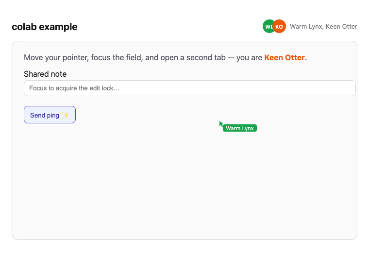
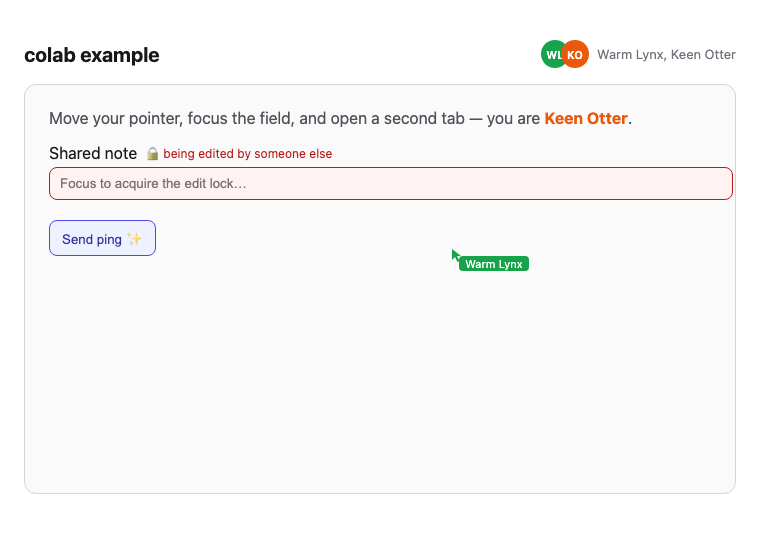

# colab example — one-line multiplayer

A plain React dashboard that becomes multiplayer with **only** `<ColabProvider>`,
a couple of colab hooks, and one custom interaction authored via
`defineInteraction`. It gains, live and cross-tab:

- **live cursors** — every participant's pointer, labeled with their name/color;
- **a "who's here" roster** — avatars + names of everyone in the room;
- **an advisory edit-lock** — focusing the shared field locks it; peers see a
  lock indicator and are advised/blocked from editing; the lock frees on blur
  **and on disconnect**;
- **a custom `reactionPing` interaction** — a button that pings a transient
  marker into every tab, authored entirely in this app with zero colab edits.

This demo is a **flat React SPA**. There is **no iframe, no CMS, and no geometry
math** in app code: colab positions cursors from anchor-relative normalized
`0–1` points through its default identity transform, so the app never computes a
pixel coordinate for a cursor. That is the geometry-free proof.



_Above: the second tab shows the first participant's labeled remote cursor
("Warm Lynx") tracking live, plus the roster avatars + names._



_Above: while a peer holds the edit-lock, this tab shows "🔒 being edited by
someone else" and the field goes read-only._

## Prerequisites

- **Node** ≥ 20 (developed on 20.20).
- **pnpm** 10.33.1 (pinned via the repo's `packageManager` field; run
  `corepack enable` to get the matching version).
- A clean checkout of this monorepo. No external services — the relay runs
  locally.

## Run it (one command)

From the **repo root**:

```bash
pnpm install
pnpm build     # builds colab-ui + colab-server so the app can resolve them
pnpm example   # starts the relay AND the app together, prints the URL
```

`pnpm example` starts the default `colab-server` and the example's Vite dev
server together, waits for the server to report it is listening, and prints:

```
▶ open the demo in TWO tabs: http://localhost:5173
```

Open that URL in **two tabs** (or two windows). Then:

1. Move your pointer over the dashboard — the other tab shows your labeled cursor.
2. Focus the **Shared note** field — the other tab shows the lock indicator and
   its field goes read-only. Blur (or close the tab) to release it.
3. Click **Send ping ✨** — a transient marker appears in **both** tabs, then
   fades.

A single `Ctrl-C` tears both the app and the relay down cleanly.

## How it works (annotated)

### 1. Root wiring — `src/App.tsx`

The entire multiplayer surface hangs off one provider. The three required props
are the one-line happy path; `interactions` registers behaviors; the DEFAULT
in-memory store is used (no `store` prop).

```tsx
import { EditLock } from "colab-ui";
import { ColabProvider, Cursor } from "colab-ui/react";
import type { Identity, Interaction } from "colab-ui/react";

import { reactionPing } from "./interactions/reactionPing.js";

// A custom interaction registers by simply appearing in this array — no core edit.
const INTERACTIONS: readonly Interaction[] = [Cursor, EditLock, reactionPing];

<ColabProvider
  serverUrl={SERVER_URL}     // the local colab-server relay
  room="demo"                // everyone in the same room sees each other
  identity={identity}        // { id, name, color } — the consumer's own vocabulary
  interactions={INTERACTIONS}
>
  <Dashboard identity={identity} />
</ColabProvider>
```

> Note: no `transport` prop is passed. The provider builds the DEFAULT
> Socket.IO transport from `serverUrl` / `room` / `identity`, which speaks the
> default server's protocol directly (see
> [Default transport — no app workaround](#default-transport--no-app-workaround)).

### 2. Roster + cursors via hooks — `src/components/Roster.tsx` / `Dashboard.tsx`

The roster is a single hook plus colab's `<AvatarStack>`; the local participant
is excluded automatically:

```tsx
import { AvatarStack, usePresence } from "colab-ui/react";

const participants = usePresence();            // remote participants (live)
// …
<AvatarStack max={5} size={28} />
```

Cursors need no geometry in app code — the dashboard panel is a `<ColabStage>`
(the anchor), `useCursorCapture()` publishes the local pointer, and
`<RemoteCursors>` renders everyone else's:

```tsx
import { ColabStage, RemoteCursors, useCursorCapture } from "colab-ui/react";

useCursorCapture();                            // publish this tab's pointer
// …
<ColabStage>{/* … */}<RemoteCursors /></ColabStage>
```

### 3. A custom interaction via `defineInteraction` — `src/interactions/reactionPing.ts`

The extensibility proof: a brand-new collaborative behavior, authored purely
with colab's public `defineInteraction`, with the same descriptor shape as the
reference `Cursor`/`EditLock` — and **no edit to any colab source**:

```ts
import { defineInteraction } from "colab-ui";

export const reactionPing = defineInteraction<PingState, PingEvent, Selectors>({
  type: "reaction-ping",
  initialState: { pings: [] },
  // Fold an inbound ping into state immutably (pure; dedup by id).
  reduce: (state, message): PingState => {
    const ping = readPing(message.payload, message.from);
    if (ping === null) return state;
    const others = state.pings.filter((existing) => existing.id !== ping.id);
    return { pings: [...others, ping] };
  },
  // Serialize a local trigger into an outbound message (pure).
  toMessage: (event) => ({
    type: "interaction",
    from: "",
    payload: { name: "reaction-ping", scopeId: PING_SCOPE, data: { ...event } },
  }),
  // Read-only view: only the not-yet-expired pings (TTL prunes on a clock).
  selectors: { active: (state) => (now) => state.pings.filter((p) => p.expiresAt > now) },
});
```

A component then just reads and sends it:

```tsx
const { send, selectors } = useInteraction(reactionPing);
const active = selectors.active(now);          // render the live markers
// …
<button onClick={() => send({ id, x: 0.5, y: 0.5, expiresAt: Date.now() + 2000 })}>
  Send ping ✨
</button>
```

Its reducer + `toMessage` are unit-tested in
`src/interactions/reactionPing.test.ts`.

## End-to-end test

A two-context Playwright test drives the whole thing across two participants —
cursors, the full lock lifecycle (acquire → indicator → release →
leave-on-disconnect), and the custom-interaction round-trip:

```bash
pnpm --filter example exec playwright test
# or, from the repo root:
pnpm e2e
```

It launches the app + relay through the same `pnpm example` command, so it
exercises exactly the documented bring-up. If the environment cannot reach the
relay (e.g. a sandbox that blocks socket binds or lacks a browser), the test
**probe-skips** with a clear message rather than hanging — run it locally in
that case.

## Troubleshooting

- **Port already in use** — the startup pins the relay to `:3001` and the app to
  `:5173` (single-source in `src/shared/ports.mjs`). Stop whatever else holds the
  port, or edit that module.
- **No remote cursor appears** — confirm both tabs joined the same `room` (they
  do by default) and that the relay started (look for the cyan `[server]
  listening` line). A `Connection refused` to `serverUrl` means the bundled
  `colab-server` did not start — re-run `pnpm example` and check the server lane.
- **Blank page / `send() called before connect()`** — you are likely running an
  older wiring or with React StrictMode; see below.

## Default transport — no app workaround

This example runs on the DEFAULT colab path with **no** app-level transport. The
provider constructs the shipped `createSocketIoTransport` from `serverUrl` /
`room` / `identity` (the example passes no `transport` prop). As of colab 0.1.1
that default transport speaks the default server's real protocol end-to-end:

- **Handshake auth** carries `roomId` + `identity`, so the server accepts the
  connection and places the socket in the right room.
- **Per-type wire events** — it emits/subscribes the `COLAB_EVENTS` /
  `COLAB_SERVER_EVENTS` the server actually uses (pointer/interaction ↔
  roster/participant/server), not a single opaque envelope.
- **Pre-connect buffering** — sends issued before `connect()` resolves are
  buffered and flushed on connect, so the provider's connect→join→send ordering
  is safe.

Earlier revisions of this example shipped a thin bridge transport to work around
gaps in the core; that workaround has been **removed** now that the shipped
default interoperates.

### Remaining note

**StrictMode relay safety** — under React StrictMode's double-invoked effects,
   the provider's cleanup clears the session and the outbound relay never
   recovers (peers see the roster but no cursors/locks/pings). The app therefore
   mounts **without** `<StrictMode>` (`src/main.tsx`).

## Keep this in sync

The snippets above are copied from real `example/` source. If you change the
wiring, the interaction, or the hooks, update this README in the **same** change
so the "one-line multiplayer" story never drifts from the code.
